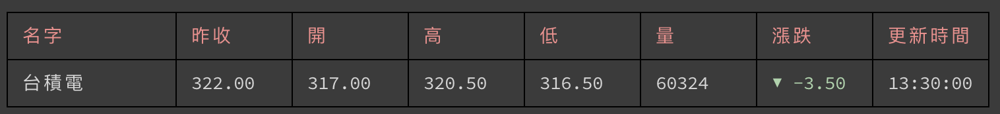

# Weather CLI in Node.js

A weather CLI app in Node.js. The app checks weather in command line.

[

## Usages

```sh
npm i -g best-stock-cli
stock price 2330 => show 2330 price
stock save myFav 2330 1101 => save the custom stock list
stock list myFav => show the price from your list
stock help => show help menu for a command
```

## Screenshots

### `main menu`


### `stock price`



### `custom stock list price`


